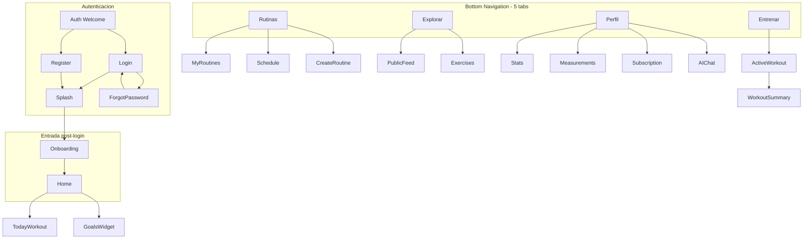

# Prompts Google Stitch — G-Pulse Mobile

## Alcance

- **Incluido:** 42 pantallas/modales + prompt de sistema de diseño (38 app + 4 autenticación).
- **Autenticación:** hub de bienvenida, login, registro, recuperar contraseña (ver Prompts A1–A4).
- **Fuente de verdad backend:** [`docs/PROJECT_MAP.md`](docs/PROJECT_MAP.md), Swagger `/api/docs`, PRDs F-02 a F-13.

## Arquitectura de navegación



**Tabs sugeridos:** Inicio | Entrenar | Rutinas | Explorar | Perfil

**Datos clave del backend por dominio:**

| Dominio | Endpoints | Campos UI relevantes |
|---------|-----------|---------------------|
| Auth | `POST /auth/login`, `POST /auth/register`, `POST /auth/google`, `POST /auth/forgot-password` | email, password min 6, name (register), Firebase idToken (Google) |
| Sesión | `GET /auth/session` | validar token en splash |
| Perfil | `GET/PATCH /users/profile` | name, level (BEGINNER/INTERMEDIATE/ADVANCED), plan (BASIC/PRO/EXPERT), pushEnabled |
| Stats | `GET /users/stats` | trainingStreak, totalWorkouts, totalCalories, totalDurationMinutes |
| Rutinas | CRUD `/routines`, `GET /routines/today`, `GET /routines/public` | name, description, exercises[], isPublic, likesCount |
| Social | `POST/DELETE /routines/:id/like`, `POST/DELETE /routines/:id/favorite`, `GET /users/me/favorites` | |
| Calendario | `GET/POST /schedule`, `DELETE /schedule/:dayOfWeek` | dayOfWeek 0=Dom..6=Sáb, routineId |
| Ejercicios | `GET /exercises`, `GET /exercises/:id` | name, muscle, difficulty, images, i18n vía `/dictionaries` |
| Workout | `POST /progress/log`, `GET /progress/history`, `GET /progress/prs`, `GET /progress/exercise/:id` | duration, calories, sets[{exerciseId, setNumber, reps, weight?}] |
| Goals | CRUD `/goals` | type: WEIGHT, WORKOUTS_PER_WEEK, CALORIES_BURN, DURATION_MINUTES; targetValue, currentValue, endDate, status |
| Mediciones | `POST/GET/DELETE /measurements`, `GET /measurements/latest` | weightKg, bodyFatPct, waistCm, chestCm, armCm, legCm, hipCm, notes |
| Suscripción | `GET /subscriptions/me`, `POST /subscriptions/upgrade`, `POST /subscriptions/cancel` | plan, isActive, startDate, endDate |
| IA | `POST /gemini/generate` | cuotas: BASIC=1, PRO=3, EXPERT=5 consultas/día |
| Push | `POST/DELETE /notifications/register-token` | pushEnabled en perfil |

---

## Cómo usar estos prompts en Stitch

1. **Primera pantalla:** pegar solo el **Prompt 0 — Design System Global**.
2. **Cada pantalla siguiente:** pegar **Prompt 0 (abreviado)** + el prompt de la pantalla. En Stitch, referencia visual: "Mantener el mismo design system que la pantalla Home".
3. **Orden recomendado:** 0 → A1 → A2 → A3 → A4 → 1 → 2 → 3 → 18 → 19 → 20 → 21 → resto por tab.
4. **Formato:** cada prompt está en inglés (mejor rendimiento en herramientas de diseño IA); las notas entre corchetes `[ES: ...]` son para ti, no las pegues en Stitch.

---

## Prompt 0 — Design System Global (pegar una vez)

```
Design a premium fitness mobile app called "G-Pulse" for iOS and Android (390×844pt frame).

Brand personality: energetic but disciplined, modern athletic tech — not generic gym clipart. Think Nike Training Club meets Strava data clarity.

Visual system:
- Dark mode primary: background #0A0E14, elevated surfaces #141B24, cards #1C2633
- Accent gradient: electric cyan #00E5FF → violet #7C4DFF (use for CTAs, progress rings, PR badges)
- Success #22C55E, warning #F59E0B, error #EF4444
- Typography: geometric sans (SF Pro / Inter style). Display 32pt bold, H1 24pt semibold, body 16pt regular, caption 12pt medium
- Corner radius: cards 16px, buttons 12px, chips 20px full pill
- Icons: outlined 24px, filled for active tab states
- Spacing: 8pt grid; screen horizontal padding 20px
- Motion intent: subtle spring on cards, haptic-worthy primary buttons, skeleton loaders on lists

Components library to establish:
- Bottom tab bar (5 tabs) with center "Train" emphasized
- Streak flame badge component
- Workout set row (set number, weight kg, reps, checkmark)
- Routine card (thumbnail, title, exercise count, duration estimate, like/favorite icons)
- Progress ring / linear bar for goals
- Plan badge pills: BASIC (gray), PRO (cyan), EXPERT (gold gradient)
- Empty state illustration style: minimal line art, single accent color
- FAB for primary actions

Accessibility: min touch target 44px, contrast WCAG AA on dark backgrounds, support Dynamic Type scaling.

Auth screens use the same tokens but may use a bolder marketing hero on the welcome hub (A1).
```

---

## Prompt A1 — Bienvenida / Hub de autenticación

```
Screen: G-Pulse Auth Welcome — unauthenticated entry (before login).

Full-bleed dark athletic background with subtle mesh gradient (cyan #00E5FF to violet #7C4DFF at 15% opacity).

Top: G-Pulse logo centered, wordmark, optional tagline "Your pulse. Your progress."

Hero zone (60% screen):
- Premium fitness photography or abstract 3D athlete silhouette with glowing pulse line (EKG-style) integrated into brand — NOT stock gym bro cliché
- Overlay headline: "Train smarter. Track everything."
- Subhead 2 lines: routines, live sets, PRs, AI coach

Bottom sheet style card anchored to bottom (rounded top 24px, surface #141B24):
- Primary gradient button "Create account" full width
- Secondary outline button "I already have an account"
- Divider "or continue with"
- Google Sign-In button: white pill, full color Google "G" icon left, label "Continue with Google"
- Footer legal: "By continuing you agree to Terms and Privacy" tappable links 12pt gray

No bottom tab bar. Status bar light. Safe areas respected.
Language: Spanish UI labels as specified above.

Navigation hints (design only): Create account → Register; I already have account → Login; Google → OAuth then app home.
```

**API:** ninguna; solo navegación.

---

## Prompt A2 — Iniciar sesión (Login)

```
Screen: G-Pulse Login — email and password.

App bar: back chevron left (returns to Auth Welcome), no title centered.

Header block:
- Title "Welcome back" 28pt bold
- Subtitle "Sign in to continue your training" gray

Form (single column, 20px horizontal padding):
1) Email field
   - Label "Email"
   - Placeholder "you@email.com"
   - Keyboard email, autocomplete username
   - Error state below: "Enter a valid email" (red #EF4444, 12pt)

2) Password field
   - Label "Password"
   - Placeholder "Minimum 6 characters"
   - Trailing icon: eye toggle show/hide password
   - Error: "Incorrect email or password" (generic, do not reveal which field failed)

Link right-aligned: "Forgot password?" cyan accent → Forgot Password screen

Primary CTA: gradient button "Sign in" full width, 52px height, disabled gray state when fields empty

Divider row: line — "or" — line

Google button identical to Welcome hub style: "Continue with Google"

Footer centered: "Don't have an account? " + link "Sign up" cyan

Loading overlay variant: button shows spinner, inputs disabled

Optional biometric row (design-only, future): small text "Use Face ID next time" with toggle — grayed "Coming soon"

Dark mode #0A0E14 background. Inputs: filled #1C2633, border focus cyan 2px.
API mapping: POST /auth/login { email, password } → returns JWT; POST /auth/google { idToken } via Firebase SDK on device.
```

---

## Prompt A3 — Crear cuenta (Register)

```
Screen: G-Pulse Register — new account.

App bar: back to Auth Welcome.

Header:
- Title "Create your account"
- Subtitle "Start tracking workouts, PRs and goals"

Form fields in order:
1) Full name — label "Name", placeholder "How should we call you?", required
2) Email — label "Email", placeholder "you@email.com"
3) Password — label "Password", placeholder "At least 6 characters", show/hide toggle
4) Confirm password — label "Confirm password", placeholder "Repeat password"
   - Error if mismatch: "Passwords don't match"

Password strength helper (optional visual): 4-segment bar under password (weak→strong) based on length/chars — design only

Checkbox row required:
- [ ] "I accept the Terms of Service and Privacy Policy" with linked words

Primary CTA gradient "Create account" — disabled until checkbox checked and all fields valid

Divider + Google "Continue with Google" same as Login

Footer: "Already have an account? " link "Sign in"

Success state frame (same screen transition): checkmark animation + "Account created!" then auto-redirect hint to Onboarding

Error banner top: "This email is already registered" for 409-style errors

API: POST /auth/register { email, password, name } min password length 6.
```

---

## Prompt A4 — Recuperar contraseña (Forgot password)

```
Screen: G-Pulse Forgot Password.

App bar: back → Login.

Header:
- Icon: mail/envelope in soft cyan circle 64px
- Title "Reset your password"
- Body copy: "Enter the email associated with your account. We'll send you a link to create a new password."

Single email field with label "Email"

Primary button "Send reset link" gradient

Secondary text button "Back to sign in"

Success variant (replace form content):
- Illustration: sent email with checkmark
- Title "Check your inbox"
- Body: "If an account exists for {email}, you'll receive instructions shortly."
- Note small gray: "Didn't receive it? Check spam or try again in 60s" with countdown timer design
- Button "Back to sign in"

No password fields on this screen — reset happens via email deep link (out of app scope for Stitch).

API: POST /auth/forgot-password { email } — always show success message (security: do not reveal if email exists).
```

---

## Prompt 1 — Splash / Validación de sesión

```
Screen: G-Pulse Splash & Session Check (post-login entry only).

Full-screen dark background with centered G-Pulse wordmark and subtle pulse animation ring behind logo.

States to design (3 variants in one artboard or separate frames):
1) Loading: checking session via API, indeterminate progress bar below logo
2) Valid session: logo scales up slightly, fade transition hint to Home (no button)
3) Invalid/expired: logo dims, text "Session expired" and secondary button "Sign in again" (links to existing login — out of scope to design)

No navigation chrome. Status bar light content.
Duration feel: 1-2 seconds max. Premium, minimal, no clutter.
```

**API:** `GET /auth/session` → si 200 navegar a Home; si 401 a login existente.

---

## Prompt 2 — Onboarding (3 pasos, primera vez)

```
Screen: G-Pulse Onboarding — 3-step carousel after first successful login.

Step 1 "Welcome":
- Hero illustration: athlete silhouette with data rings (streak, PR, goals)
- Headline: "Train smarter. Track everything."
- Subcopy: routines, live workout logging, body measurements, AI coach
- Primary button "Continue", skip link top-right

Step 2 "Your level":
- Title: "What's your experience?"
- Three large selectable cards: Beginner / Intermediate / Advanced
- Each card: icon, 1-line description, selected state with cyan border glow
- Maps to API enum: BEGINNER, INTERMEDIATE, ADVANCED

Step 3 "Weekly plan" (optional):
- Title: "Plan your week"
- Mini Mon-Sun row; tap a day opens "Assign routine" placeholder (can skip)
- Primary "Finish setup", secondary "I'll do this later"
- Progress dots 1/3, 2/3, 3/3

Design all 3 steps with shared header progress. Dark theme, generous whitespace.
```

**API:** `PATCH /users/profile` con `level`; opcional `POST /schedule` por día.

---

## Prompt 3 — Home / Dashboard

```
Screen: G-Pulse Home Dashboard — main tab "Inicio".

Top app bar:
- Left: greeting "Good morning, {name}" + small avatar circle
- Right: notification bell (badge dot) + streak chip "🔥 12 days"

Hero card "Today's Workout" (dominant, full width):
- If routine scheduled today: routine name, muscle tags chips, estimated duration, exercise count, large gradient CTA "Start Workout"
- Empty state variant: dashed card "No workout scheduled" + button "Set up week"

Below hero, horizontal scroll "Quick stats" (3 mini cards):
- Workouts this week count
- Calories burned total
- Active goals progress % (ring)

Section "Your goals" (max 2 visible):
- Goal cards with type icon, title, progress bar, target label e.g. "3/4 workouts"
- Link "See all goals"

Section "Recent activity":
- Last 3 workout rows: date, routine name, duration, calories
- Chevron to full history

Bottom tab bar visible, Home tab active.

Include pull-to-refresh affordance at top.
Data sources: GET /routines/today, GET /users/stats, GET /goals (active), GET /progress/history?limit=3
```

---

## Prompt 4 — Bottom Navigation Shell (referencia)

```
Screen: G-Pulse — Bottom Tab Bar reference component.

5 tabs with labels in Spanish:
1 Inicio (home icon)
2 Entrenar (dumbbell/play icon) — visually emphasized: slightly larger icon, accent dot or raised pill background
3 Rutinas (calendar/list icon)
4 Explorar (compass/grid icon)
5 Perfil (person icon)

Show on dark #141B24 bar with top hairline border. Active tab: cyan accent + label bold. Inactive: gray #6B7280.

Design one screen with tab bar only + blurred content behind to show overlay behavior.
Safe area for iPhone home indicator included.
```

---

## Prompt 5 — Mis Rutinas (lista)

```
Screen: G-Pulse My Routines list — tab Rutinas.

App bar: title "My Routines", search icon, filter icon (public/private/all).

Segmented control: "Mine" | "Favorites" (second tab loads bookmarked public/own routines)

Routine cards list:
- Thumbnail (exercise collage or gradient placeholder)
- Title, subtitle with exercise count + "~45 min"
- Badges: "Public" globe icon if isPublic
- Overflow menu: Edit, Duplicate, Delete, Share
- Swipe left actions: Delete (red), Favorite (star)

FAB bottom-right: "+" gradient button "New routine"

Empty state: illustration + "Create your first routine" + same FAB

Pull to refresh. Skeleton loading for 3 cards.
```

**API:** `GET /routines`, `GET /users/me/favorites`, `DELETE /routines/:id`

---

## Prompt 6 — Detalle de rutina (propia)

```
Screen: G-Pulse Routine Detail (owner view).

Hero header:
- Collapsing image/header gradient
- Routine title large, description 2 lines
- Row: Public toggle, Like count (if public), Favorite star filled/outline

Stats row: {n} exercises · ~{duration} min · Created date

Sticky bottom bar with two buttons:
- Primary "Start Workout" (full width gradient)
- Secondary outline "Edit routine"

Exercise list (ordered):
- Each row: exercise thumbnail 56px, name, muscle chip, "3 × 12" sets×reps, drag handle for reorder (edit mode)
- Rest indicator between supersets optional

Top bar: back, title truncated, edit icon, delete icon (confirmation modal separate)

Menu sheet: "Add to schedule", "Duplicate", "Make public/private"
```

**API:** `GET /routines/:id`, `PATCH`, `POST/DELETE favorite`

---

## Prompt 7 — Crear rutina: selector de método

```
Screen: G-Pulse Create Routine — method picker (modal or full screen).

Title: "New routine"
Two large option cards:

Card A "Build manually":
- Icon: checklist
- Copy: pick exercises from catalog, set sets and reps
- Chevron

Card B "Generate with AI":
- Icon: sparkles gradient
- Copy: describe your goal, AI builds the routine
- Badge "PRO" if plan BASIC (locked state with upgrade hint)
- Chevron

Cancel X top-left.
Dark cards with subtle border glow on press state.
```

**API:** `POST /routines` con `fromAi: false` o `fromAi: true`

---

## Prompt 8 — Crear rutina manual (builder)

```
Screen: G-Pulse Manual Routine Builder — multi-section form.

Section 1:
- Text field "Routine name" (required)
- Text area "Description" optional
- Toggle "Make public" with helper text

Section 2 "Exercises":
- Button "Add exercise" opens catalog picker (show as bottom sheet preview in same frame: search bar + exercise list with + buttons)
- Added exercises list: each expandable row to edit sets (stepper), reps (stepper), rest seconds optional
- Reorder via drag handles
- Delete exercise swipe

Sticky footer: "Save routine" primary disabled until name + ≥1 exercise

Top: back, "Draft" autosave hint optional
```

**API:** `POST /routines` body: name, description, isPublic, exercises[]

---

## Prompt 9 — Crear rutina con IA (wizard)

```
Screen: G-Pulse AI Routine Generator — 2-step wizard.

Step 1 input form:
- Multiline prompt: placeholder "I want a 45-min push day for intermediate, dumbbells only..."
- Chips quick prompts: "Full body beginner", "Leg day hypertrophy", "HIIT 20 min"
- Dropdowns: Muscle focus, Equipment, Level (pre-filled from profile)
- Quota indicator: "2/3 AI generations left today" with plan badge
- Button "Generate" with sparkles icon, loading state with animated shimmer

Step 2 preview results:
- Generated routine name editable
- Exercise list preview (read-only cards) with regenerate icon
- Buttons: "Save routine", "Regenerate", "Edit manually"

Error state: quota exceeded — upsell card to PRO plan
```

**API:** `POST /routines` fromAi:true + aiPrompt; cuotas Gemini por plan

---

## Prompt 10 — Editar rutina

```
Screen: G-Pulse Edit Routine — same layout as Manual Builder (Prompt 8) but:

- Pre-filled fields
- App bar title "Edit routine"
- Destructive text button "Delete routine" at bottom (red)
- Save = "Update routine"

Show diff highlight on modified exercise rows optional (subtle cyan dot).
```

**API:** `PATCH /routines/:id`

---

## Prompt 11 — Calendario semanal

```
Screen: G-Pulse Weekly Schedule Editor.

Title: "Weekly plan"
Subtitle: "Assign a routine to each training day"

Vertical list Mon-Sun (locale Spanish labels: Lun, Mar, Mié... Dom):
- Each row: day label left, routine name or "Rest day" gray
- Tap row → bottom sheet picker: list user's routines + "Rest / clear"
- Enabled toggle per day

Visual: today highlighted with cyan left border

Footer tip card: "Today's workout" preview linking to assigned routine

Save is automatic on selection (toast "Saved") — no big save button needed
```

**API:** `GET /schedule`, `POST /schedule` upsert, `DELETE /schedule/:dayOfWeek` (0=Sunday)

---

## Prompt 12 — Explorar: Feed público

```
Screen: G-Pulse Explore — Public Routines Feed.

App bar: "Explore" + search field

Filter chips horizontal scroll: All, Chest, Back, Legs, Full body, Beginner, etc.

Feed cards (Instagram-adjacent but fitness-focused):
- Author avatar + name (or "G-Pulse Community")
- Routine title, description clamp 2 lines
- Image carousel of first 3 exercise thumbnails
- Stats: exercises count, likes count, "~duration"
- Actions row: Heart (like, filled when liked), Bookmark (favorite), "Use routine" outline button (copies/adds to mine)

Infinite scroll loading footer

Empty search: "No routines found"
```

**API:** `GET /routines/public`, `POST/DELETE /routines/:id/like`, `POST/DELETE .../favorite`

---

## Prompt 13 — Detalle rutina pública (visitante)

```
Screen: G-Pulse Public Routine Detail (non-owner).

Same as Routine Detail but:
- No edit/delete
- Author section at top
- Prominent "Save to my routines" or "Add to favorites"
- Like button in header
- "Start workout" still available (uses this routine id in log)

Show social proof: "124 likes"
```

---

## Prompt 14 — Favoritos

```
Screen: G-Pulse Favorites — can be tab inside My Routines or standalone list.

Title "Saved routines"
Grid or list toggle (optional)

Cards identical to feed but without author — focus on quick start
Swipe to unfavorite

Empty: bookmark illustration "Save routines from Explore"
CTA button "Discover routines" → Explore tab
```

**API:** `GET /users/me/favorites`

---

## Prompt 15 — Catálogo de ejercicios

```
Screen: G-Pulse Exercise Catalog.

Search bar sticky top with filter button opening sheet:
- Muscle group multi-select
- Difficulty: Easy / Medium / Hard
- Equipment type (from dictionaries)

Results: 2-column grid on mobile
- Card: exercise image 1:1, name, muscle chip, difficulty dots

List view toggle optional

Tap → Exercise Detail
Skeleton grid while loading
```

**API:** `GET /exercises?search=&muscle=&page=` + `GET /dictionaries` para labels ES

---

## Prompt 16 — Detalle de ejercicio

```
Screen: G-Pulse Exercise Detail.

Hero: large image or video placeholder 16:9
Title + muscle + equipment chips
Difficulty indicator

Tabs below hero: "Instructions" | "History" | "Media"

Instructions tab:
- Steps numbered list
- Tips callout card
- Primary muscles diagram placeholder

History tab teaser: mini chart "Last 8 sessions" + link to full progress screen

Bottom sticky bar: "Add to routine" (if from builder) OR "View my progress"

Favorite exercise — out of scope backend, omit.
```

**API:** `GET /exercises/:id`, `GET /progress/exercise/:id`

---

## Prompt 17 — Progreso por ejercicio (gráfica)

```
Screen: G-Pulse Exercise Progress Analytics.

App bar: exercise name, back
Time range chips: 1M | 3M | 6M | 1Y | All

Main chart: line chart weight (kg) over time — best set per session
Secondary chart optional: volume (sets×reps×weight) bars

Below chart: session list grouped by date
Each session expandable showing all sets: Set 1: 80kg × 8 reps

Highlight PR sessions with gold trophy icon
Empty: "Log a workout with this exercise to see progress"
```

**API:** `GET /progress/exercise/:id`

---

## Prompt 18 — Pre-entreno / Inicio

```
Screen: G-Pulse Pre-Workout Start.

Full bleed routine cover gradient
Routine name, today's date, estimated duration

Checklist preview: exercise names with planned sets×reps
"Edit plan" link small

Large circular play button center-bottom "Start"
Secondary: "Choose different routine" if opened from Train tab without today

Optional: last performance hint per exercise "Last time: 75kg × 8"

Keep screen focused — user is about to train, minimal distraction.
```

**API:** `GET /routines/:id` o `GET /routines/today`

---

## Prompt 19 — Sesión de entreno activa (pantalla crítica)

```
Screen: G-Pulse Active Workout Session — the core UX screen.

Top bar:
- Elapsed timer MM:SS (large, monospace feel)
- Pause icon, Finish workout text button (accent)

Progress: "Exercise 2 of 8" thin progress bar

Current exercise card (dominant):
- Exercise image left, name + muscle
- Planned target gray: "3 sets × 12 reps @ 60kg suggested"

Sets table (scrollable):
Columns: Set # | Previous (ghost column) | kg | Reps | ✓
- Each set row: inputs for weight and reps, checkbox complete
- Row states: pending, active (cyan highlight), completed (green check, slightly dimmed)
- Button "+ Add set"

Between sets: Rest timer banner collapsible "Rest 1:30" with skip button

Bottom nav within workout:
- Previous exercise | Next exercise (or "Finish" on last)

Floating optional: RPE picker sheet 1-10 — note: backend v1 may not store RPE, design for future

Do NOT clutter with social features during workout.
Design portrait, one-hand friendly, inputs large for gym use with sweaty hands.
```

**API:** al finalizar → `POST /progress/log` con sets[]

---

## Prompt 20 — Temporizador de descanso (overlay)

```
Screen: G-Pulse Rest Timer — modal overlay on Active Workout.

Semi-transparent dark scrim over blurred workout behind

Center: circular countdown 90s default, animating ring depleting cyan→violet
Large time digits
Buttons: -15s | +15s | Skip rest
Haptic-style visual pulse at 3-2-1

Next set preview small text at bottom: "Up next: Set 2 — Bench Press"
```

---

## Prompt 21 — Resumen post-entreno

```
Screen: G-Pulse Workout Complete Summary — celebration + confirm.

Confetti-subtle particles (not childish)

Hero stats 2×2 grid:
- Duration
- Calories
- Sets completed
- Volume lifted (sum kg×reps) — client calculated

List PR achievements if any: gold cards "New PR! Bench Press 85kg"

Notes field optional multiline

Primary "Save workout" → posts log
Secondary "Discard" destructive confirm dialog variant

Mood optional emoji row (design only, no API yet)
```

**API:** `POST /progress/log`; respuesta puede incluir PR detectados

---

## Prompt 22 — Historial de entrenamientos

```
Screen: G-Pulse Workout History.

Title "History"
Group by month headers
Each row: date, routine name, duration, calories, chevron
Tap → detail bottom sheet with full sets breakdown read-only

Filter icon: date range
Stats header optional: total workouts this month

Empty state: "No workouts yet" + CTA Start from Home
```

**API:** `GET /progress/history`

---

## Prompt 23 — Records personales (PR Hall)

```
Screen: G-Pulse Personal Records Hall.

Title "Personal Records" with trophy header illustration

List grouped by muscle:
- Exercise name, PR weight kg, date achieved, delta vs previous small green +2kg

Sort: Recent | Heaviest | A-Z

Tap exercise → Exercise Progress screen

Empty: "Hit a new max to see PRs here"

Gold accent for top 3 lifts optional "Leaderboard of self"
```

**API:** `GET /progress/prs`

---

## Prompt 24 — Estadísticas / Perfil stats

```
Screen: G-Pulse Stats Overview (from Profile or Home deep link).

Hero: training streak large flame number + "day streak" + longest streak placeholder

Grid cards:
- Total workouts
- Total hours (from totalDurationMinutes)
- Total calories
- Routines created count

Chart: workouts per week bar chart last 8 weeks

Plan badge and level badge displayed
Link "Body measurements" and "Goals"
```

**API:** `GET /users/stats`

---

## Prompt 25 — Lista de objetivos

```
Screen: G-Pulse Goals List.

FAB "+ New goal"
Tabs: Active | Achieved | Abandoned

Goal cards:
- Type icon (scale, calendar, fire, clock)
- Title derived from type e.g. "4 workouts per week"
- Progress bar with % and current/target numbers
- Deadline date if set
- Status pill

Empty active: target illustration + create CTA

Swipe to abandon/delete
```

**API:** `GET /goals` — types: WEIGHT, WORKOUTS_PER_WEEK, CALORIES_BURN, DURATION_MINUTES; fields targetValue, currentValue, endDate, status

---

## Prompt 26 — Crear objetivo

```
Screen: G-Pulse Create Goal — step form.

Step 1: Pick goal type (4 cards with icons and examples)
Step 2: Target value numeric input with unit label (kg, workouts, kcal, minutes)
Step 3: Optional end date date-picker
Step 4: Review summary card

For WEIGHT type: clarify gain vs loss with toggle

Save button "Create goal"
Validation errors inline
```

**API:** `POST /goals`

---

## Prompt 27 — Detalle de objetivo

```
Screen: G-Pulse Goal Detail.

Large progress ring center showing %
Current vs target numbers
Timeline: start date — end date
History mini log of contributing workouts (for WORKOUTS_PER_WEEK)

Actions: Mark achieved (manual), Abandon, Edit target
Edit opens bottom sheet
```

**API:** `GET /goals/:id`, `PATCH /goals/:id`, `DELETE`

---

## Prompt 28 — Dashboard mediciones corporales

```
Screen: G-Pulse Body Measurements Dashboard.

Title "Body"
Latest snapshot card grid 2×3:
- Weight kg (large)
- Body fat %
- Waist, Chest, Arm, Leg, Hip cm — each mini sparkline

Primary CTA "+ Log measurement"
Time range filter for charts

Main chart toggle tabs: Weight | Body fat | Waist (line charts)

Compare to last entry: green/red delta arrows
```

**API:** `GET /measurements/latest`, `GET /measurements`

---

## Prompt 29 — Registrar medición (formulario)

```
Screen: G-Pulse Log Body Measurement form.

Date picker default today
Numeric fields with steppers (at least one required):
- Weight (kg) — primary emphasized
- Body fat %
- Waist, Chest, Arm, Leg, Hip (cm)
Notes optional

Smart validation hints under fields (ranges 20-300kg etc.)
Save button sticky bottom
Success toast then navigate back to dashboard
```

**API:** `POST /measurements`

---

## Prompt 30 — Historial de mediciones

```
Screen: G-Pulse Measurement History list + chart.

Same chart as dashboard but full height
Scrollable log entries: date, weight, key deltas, notes preview
Swipe delete with undo snackbar
Tap entry → view only detail sheet
```

**API:** `GET /measurements`, `DELETE /measurements/:id`

---

## Prompt 31 — Perfil

```
Screen: G-Pulse Profile tab.

Header: large avatar (editable camera overlay), name, email, level chip, plan badge

Menu list grouped:

GROUP Activity
- Statistics →
- Workout history →
- Personal records →
- Body measurements →
- Goals →

GROUP Training
- My routines →
- Weekly schedule →
- Favorites →

GROUP Account
- Subscription →
- Notifications toggle (pushEnabled)
- Change password →
- Language (placeholder)

GROUP Support
- Help, Privacy, Log out (red text)

Version footer "G-Pulse v1.0"
```

**API:** `GET /users/profile`, `PATCH` pushEnabled

---

## Prompt 32 — Editar perfil

```
Screen: G-Pulse Edit Profile.

Avatar change button
Fields: Display name, Experience level picker (3 options)
Read-only email
Save button

Do not allow plan change here — subscription screen handles it
```

**API:** `PATCH /users/profile` name, level

---

## Prompt 33 — Ajustes / Notificaciones

```
Screen: G-Pulse Settings.

Sections:
Notifications: master toggle pushEnabled, sub-toggles design-only (Workout reminders, PR celebrations, Streak milestones) — note: backend only has pushEnabled global for now, mark sub-toggles as "coming soon" disabled

Account security: Change password → navigates to existing flow
Delete account — grayed "Contact support"

Theme: Dark locked (light mode future)
Units: kg/cm vs lb/in toggle (client-side preference)
```

**API:** `PATCH /users/profile` pushEnabled; FCM `POST /notifications/register-token` on enable

---

## Prompt 34 — Planes de suscripción (paywall)

```
Screen: G-Pulse Subscription Plans — upgrade.

Title "Unlock your potential"
Billing toggle Monthly / Annual (annual save badge)

3 plan cards vertical scroll:
BASIC (free): 1 AI gen/day, basic stats — current plan checkmark
PRO: 3 AI/day, priority — highlighted recommended border glow
EXPERT: 5 AI/day, all features — gold accents

Feature comparison checklist per plan
Sticky bottom: "Continue with PRO" gradient button
Legal links small print

Design aspirational — this screen sells the app.
```

**API:** `POST /subscriptions/upgrade` body plan enum

---

## Prompt 35 — Estado de suscripción / Gestionar

```
Screen: G-Pulse Subscription Status.

Current plan card: name, active badge, start date, renewal/end date if any
Benefits list for current plan

If active paid: button "Cancel subscription" outline red → confirmation modal
If canceled: banner "Access until {endDate}"
Upgrade CTA if BASIC

Cancel modal: two-step "Are you sure?" with retention copy, confirm cancel
```

**API:** `GET /subscriptions/me`, `POST /subscriptions/cancel`

---

## Prompt 36 — Coach IA / Gemini chat

```
Screen: G-Pulse AI Coach chat interface.

Chat bubbles UI dark theme
User messages right cyan tint, AI left gray elevated cards
Input bar: multiline + send, attach routine context chip optional

Header: "AI Coach" + quota pill "1/1 today" for BASIC
Empty state suggested prompts chips:
- "How do I break a plateau on bench?"
- "Deload week plan for intermediate"
- "Explain RPE training"

Loading: typing indicator three dots
Error: quota exceeded → inline upgrade card

Disclaimer footer small: "AI can make mistakes. Not medical advice."
```

**API:** `POST /gemini/generate` — límites BASIC 1, PRO 3, EXPERT 5/día

---

## Prompt 37 — Tab Entrenar (hub)

```
Screen: G-Pulse Train Tab — entry hub when not in active workout.

If workout in progress: resume card prominent "Continue Push Day — 23:14 elapsed"

Else:
- Big card Today's routine (from schedule) + Start
- Or "Quick start" list: recent 3 routines
- Button "Browse routines"
- Button "Empty workout" log duration only (cardio/yoga)

Secondary link: "View PRs" "View history"

This tab is the gym mode entry — high contrast, large touch targets.
```

**API:** `GET /routines/today`, `GET /routines` recientes

---

## Prompt 38 — Modales y estados transversales

```
Design system addendum — G-Pulse Global States (single artboard grid):

1) Empty state template: icon, title, body, primary CTA
2) Error state: offline, server error 500, retry button
3) Loading skeleton: list, detail, chart variants
4) Confirmation dialog: delete routine, cancel subscription, discard workout
5) PR celebration modal: fullscreen takeover gold confetti, exercise name, new PR kg, share button design-only
6) Streak milestone toast: "30 day streak!" banner
7) Success snackbar standard

Style consistent with Prompt 0 design system. Dark mode only.
```

---

## Prompt abreviado (pegar en pantallas 2–38)

```
Continue G-Pulse design system: dark #0A0E14, cyan-violet gradient accents, 390×844 mobile, geometric sans, 8pt grid, premium athletic aesthetic. Same components as established.
```

---

## Orden de producción en Stitch (recomendado)

| Fase | Pantallas | Prioridad |
|------|-----------|-----------|
| 0 Auth | 0, A1, A2, A3, A4 | Alta (primero en flujo usuario nuevo) |
| 1 Fundación | 0, 4, 38 | Alta |
| 2 Core workout | 18, 19, 20, 21, 37 | Crítica |
| 3 Home + rutinas | 3, 5, 6, 7, 8, 11 | Alta |
| 4 Explorar + ejercicios | 12, 13, 15, 16, 17 | Media |
| 5 Progreso | 22, 23, 24, 25–30 | Media |
| 6 Cuenta | 31–36, 2, 1 | Media |
| 7 Social | 14 | Baja |

---

## Notas de implementación móvil (no es diseño, pero alinea Stitch)

- Registrar token FCM tras login en [`notifications.controller.ts`](src/notifications/notifications.controller.ts).
- Diccionarios i18n: precargar `GET /dictionaries` para etiquetas de músculos/equipo en ES.
- Admin panel (`/admin/*`) **no** requiere pantallas en app consumidor.
- Post-MVP (coaches, nutrición, wearables) **fuera** de este paquete de prompts.

---

## Entregable siguiente (al confirmar plan)

Crear archivo `docs/design/STITCH_PROMPTS.md` en el repo con todo el contenido anterior formateado para copiar/pegar, si lo deseas versionado junto al backend.
